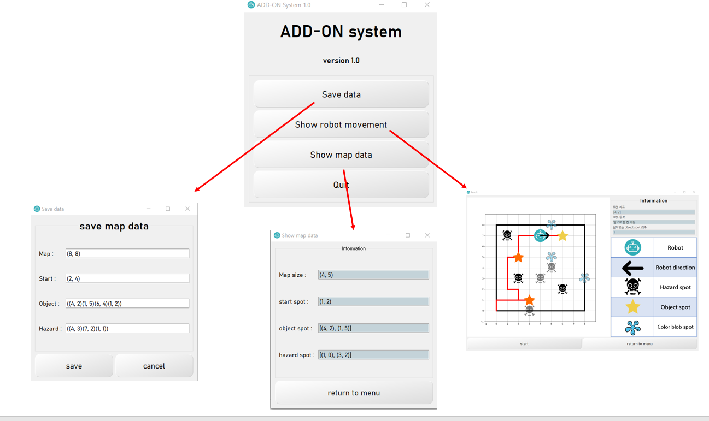

# ADD-ON System
재난 지역의 탐사에 사용하는 로봇의 동작을 제어하는 프로그램입니다.
  

## Scenario
 화재, 지진, 폭발, 독성 물질 유출과 같은 여러 종류의 재난 상황이 발생한 경우에 체계적인 상황 해제를 위해서는 재난지역에서 위험 지점은 어디이고, 구조 대상은 어디에 있는지 파악할 필요가 있다.  이러한 정보가 명확히 주어지지 않은 상태에서는 로봇이 효과적인 해결책이 될 수 있는데, 이러한 상황에서 사용할 수 있도록 로봇의 동작을 자동으로 제어할 수 있는 시스템인 ADD-ON을 만들어야 한다.
  

## 주요 정보

 자세히 보기 

  > 1. 사용자는 미리 재난 지역의 지도 정보를 알려준다. 지도에는 위험 지점(hazard spot), 목표 지점(object spot)이 존재한다.

  > 2. 미리 알려준 지도 정보는 부정확한 정보이며, 알려지지 않은 위험 지점과 중요 지점(color blob spot)이 존재할 수 있다.

  > 3. 로봇은 세 가지의 센서를 가지고 있다.  첫 번째는 hazard sensor로, 로봇 전방 1칸 앞이 위험 지점인지 판별한다.  두 번째는 color blob sensor로, 로봇의 전후좌우 1칸이 중요 지점인지 판별한다.  마지막은 positionion sensor로, 로봇의 지도상 좌표를 알려준다. ADD-ON System은 SIM의 세 가지 센서에서 값을 얻을 수 있으며, SIM의 robot movement interface를 통해 로봇의 동작을 지시한다.

  

## 요구사항

 자세히 보기 

  ADD-ON System은 다음의 요구사항을 만족시켜야 한다.

 > Handling map data  
   사용자로부터 지도 자료를 입력받아 지도를 그려야 한다. 로봇의 이동 도중 탐색한 지점들은 지도에 실시간으로 표시한다.

 > Planning a path   
    사용자로부터 (로봇의 출발점, 로봇이 탐색할 지점들의 순서 집합)을 입력받아 위험 지점을 지나지 않는 경로를 생성해야 한다.
 
 > Following a given path  
    시스템은 SIM의 robot movement interface를 이용해 동작을 지시한다. 이 인터페이스는 앞으로 1칸 이동, 시계방향으로 90도 회전하는 기능을 제공한다.

 > Avoiding hidden hazards  
    지도상에 적혀있지 않은 숨겨진 위험 지역이 있을 수 있다. SIM의 hazard sensor를 이용해 이를 탐지하고, 지도에 표시한 뒤 새 경로를 계산해야 한다.

 > Detecting color blobs  
    지도 상에 표시되지 않은 중요 지점들이 있다. 로봇이 경로를 따라가는 도중 color blob sensor를 통해 이를 발견하면 지도에 위치를 표시해야 한다.

 > Compensating for imperfect motion  
    로봇이 오작동을 일으킬 가능성이 있다. 로봇을 한 칸 앞으로 움직이려 했을 때 움직이지 않거나, 두 칸 앞으로 움직일 가능성이 있다. SIM의 positioning sensor로 이와 같은 경우를 탐지할 수 있어야 하며, 그에 맞게 경로를 수정해야 한다.

## 사용 언어
 > Python3
 
## 사용 라이브러리 
 > 내부 로직
  > * numpy
  
 > GUI
  > * PyQt5
  > * matplotlib

  
## 맵 데이터 입력 형식
 ---------------------------
 Map : (지도 가로 크기, 지도 세로 크기)  
 Start : (x 좌표, y 좌표)  
 Object : ((x 좌표, y 좌표)(x 좌표, y 좌표)...)     ->  목표 지점으로 넣고 싶은 만큼 입력해주세요.  
 Hazard : ((x 좌표, y 좌표)(x 좌표, y 좌표)...)     ->  위험 지점으로 넣고 싶은 만큼 입력해주세요.  
   
## 실행 예시
### 화면 흐름도
</img> 
 
### 메인 화면  
</img> 
 
### 맵 데이터 설정  
</img> 
 
### 설정된 맵 데이터 확인  
</img> 
 
### 로봇 작동 과정 
</img> 
</img> 

시연 영상은 [여기](https://github.com/sunga201/MySEProject/tree/2021/01/17_revise/%EC%82%B0%EC%B6%9C%EB%AC%BC/%EC%8B%9C%EC%97%B0%20%EC%98%81%EC%83%81)를 참조해주세요.
  
## 실행 방법
1. python을 이용한 실행
   1. 콘솔 창에 pip install -r requirements.txt
   2. 콘솔 창에 python main_menu.py
   
2. 실행 파일 이용
   add-on 폴더의 main.exe 파일을 실행합니다. image 폴더는 실행에 필요하므로 main.exe와 동일한 폴더에 위치해야 합니다.
